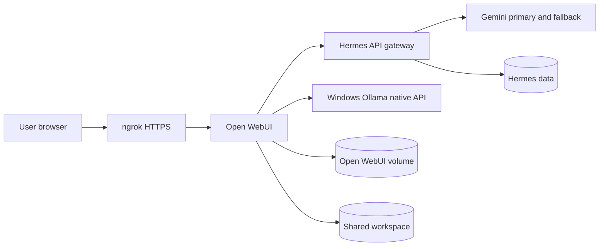

# Current Implementation Plan

## Objective

Provide an authenticated Open WebUI portal for Hermes Agent with audited tools, durable workspace evidence, current cloud model routing, a native local GPU model, and a deny-by-default Telegram integration.

## Components

## Ownership Boundaries

- Open WebUI owns login, chat history, models, tools, and prompts.
- Hermes owns provider routing, sessions, memory, and the OpenAI-compatible gateway.
- ngrok exposes Open WebUI only.
- The shared workspace owns reproducible evidence and generated artifacts.
- Windows Ollama is a LAN-only native model provider for Open WebUI.

## Deployment Phases

1. Start Docker services and verify persistent mounts.
2. Validate provider credentials independently.
3. Configure Hermes cloud routing and Open WebUI's native Ollama connection.
4. Deploy the seven audited Open WebUI tools.
5. Publish the master, nine specialist, and one local GPU model.
6. Install ten reusable prompt-library entries.
7. Run model, tool, skill, and workflow acceptance suites.
8. Recreate containers and verify persistence plus public access.
9. Enable Telegram only after receiving a bot token and explicit user allowlist.

## Acceptance Gates

- Open WebUI is reachable through ngrok after recreation.
- Open WebUI signup is disabled and no browser-native auth popup appears.
- Hermes authenticated API returns a real chat completion.
- At least one cloud route and the native local model are available.
- Seven canonical tools pass their direct harness.
- Eleven published model profiles pass smoke tests.
- Nine specialists have substantive saved artifacts.
- Ten prompt patterns are present in Open WebUI.
- Thirty skills have reproducible evidence.
- Four daily workflows complete with saved artifacts.
- Final reports contain no provider tokens or portal passwords.

## Current Limitations

- Free cloud routes can be rate-limited or require credit without notice; slow optional providers are excluded from automatic fallback.
- The ngrok free endpoint can change unless the account provides a reserved domain.
- Telegram activation requires external bot credentials and an authorized numeric user ID.
- The local 4B model is an always-available direct route, not the preferred quality route.

## Required Evidence

All evidence lives under `~/hermes_workspace/shared/outputs`:

- `hermes_final_status.md`
- `hermes_test_matrix.csv`
- `hermes_model_routing.md`
- `hermes_troubleshooting.md`
- `hermes_acceptance_report.md`
- tool and model JSON results
- specialist artifacts
- FastAPI, research, shell, and UI workflow directories
